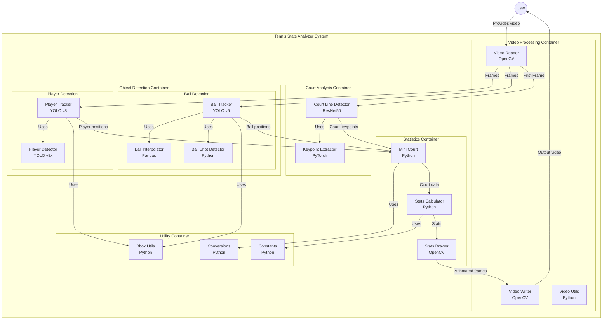

# Tennis Stats Analyzer

## Introduction
This project analyzes Tennis players in a video to measure their speed, ball shot speed and number of shots. This project will detect players and the tennis ball using YOLO and also utilizes CNNs to extract court keypoints. This hands on project is perfect for polishing your machine learning, and computer vision skills. 

## Output Videos
Here is a screenshot from one of the output videos:

## Models Used
* YOLO v8 for player detection
* Fine Tuned YOLO for tennis ball detection
* Court Key point extraction

## Training
* Tennis ball detetcor with YOLO: training/tennis_ball_detector_training.ipynb
* Tennis court keypoint with Pytorch: training/tennis_court_keypoints_training.ipynb

## Requirements
* python3.8
* ultralytics
* pytroch
* pandas
* numpy 
* opencv

