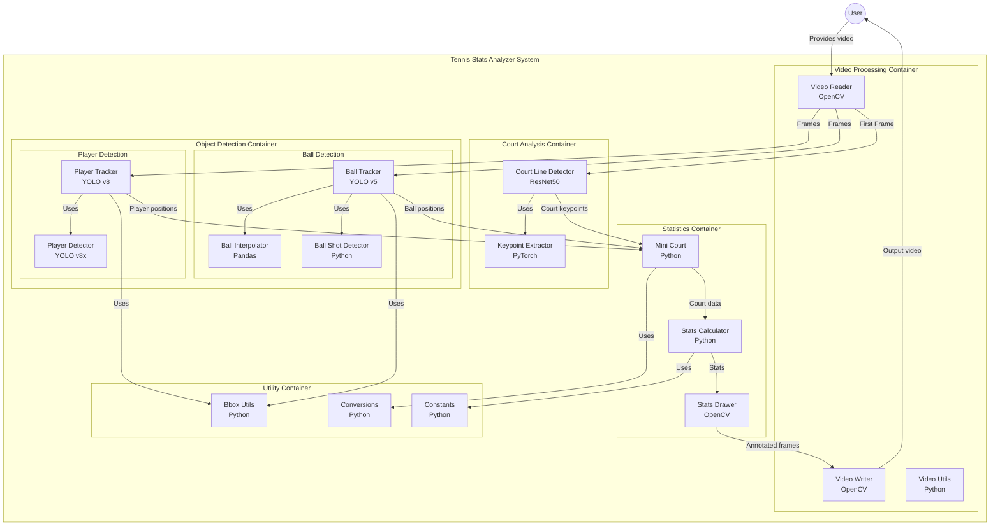

# Tennis Stats Analyzer

Tennis Stats Analyzer is an end-to-end computer vision and machine learning project designed to analyze tennis match videos. The system detects players and the tennis ball, estimates ball shot speed, measures player movement, and calculates key match statistics. It leverages state-of-the-art object detection models (YOLO v8 and a fine-tuned YOLO variant) as well as convolutional neural networks for court keypoint extraction.

---

## Table of Contents

- [Tennis Stats Analyzer](#tennis-stats-analyzer)
  - [Table of Contents](#table-of-contents)
  - [Introduction](#introduction)
  - [Features](#features)
  - [Models and Methodology](#models-and-methodology)
  - [Training](#training)
  - [Installation and Requirements](#installation-and-requirements)
    - [Dependencies](#dependencies)
    - [Installation Steps](#installation-steps)
  - [Usage](#usage)
  - [Project Structure](#project-structure)
  - [Output Demonstration](#output-demonstration)
  - [License](#license)
  - [Acknowledgments](#acknowledgments)

---

## Introduction

Tennis Stats Analyzer processes input tennis match videos to extract valuable statistics for players. By detecting players and the tennis ball and mapping their positions onto a calibrated mini-court, the system is able to:
- Measure the speed of ball shots (in km/h)
- Track player movement and speed
- Compute averages and cumulative statistics for each player over the duration of a match

This project is ideal for those looking to enhance their machine learning and computer vision skills while working on a real-world sports analytics problem.

---

## Features

- **Player Detection:** Uses YOLO v8 to detect players in each frame.
- **Ball Detection:** Employs a fine-tuned YOLO model for precise tennis ball detection.
- **Court Keypoint Extraction:** Utilizes a CNN (based on ResNet50) to extract critical court keypoints for spatial calibration.
- **Statistical Analysis:** Computes shot speeds, player movement speeds, and averages based on frame-by-frame analysis.
- **Visualization:** Generates annotated videos showing bounding boxes, court overlays, and player statistics in real time.
- **Modular Design:** Clean separation of components (detection, tracking, court calibration, statistics computation, and video rendering) facilitates further development and experimentation.

---

## Models and Methodology

- **YOLO v8:** For detecting tennis players in the input video frames.
- **Fine-Tuned YOLO:** Customized model for detecting the tennis ball with higher precision.
- **Court Keypoint Extraction:** A ResNet50-based network fine-tuned to predict 14 (x, y) keypoints on the court to establish a mini-court for metric conversion.
- **Tracking and Statistics Computation:** Custom tracker modules associate detections over time, interpolate missing data, and compute speeds by converting pixel distances into real-world meters using court dimensions.

**Sources:**
- [Ultralytics YOLO Documentation](https://docs.ultralytics.com/)
- Chollet, F. (2017). *Deep Learning with Python*. Manning Publications.

---

## Training

Training notebooks are provided to fine-tune both the tennis ball detector and the court keypoint extraction model:

- **Tennis Ball Detector Training:**  
  See `training/tennis_ball_detector_training.ipynb` for setting up and training the ball detection model using YOLO.

- **Tennis Court Keypoints Training:**  
  See `training/tennis_court_keypoints_training.ipynb` for data preparation, model setup, and training of the keypoint extraction CNN.

Additional dataset details and configuration files are provided in the `training/tennis-ball-detection-6` folder.

---

## Installation and Requirements

The project requires Python 3.8 and a set of libraries for computer vision, deep learning, and data manipulation.

### Dependencies

- Python 3.8
- [Ultralytics](https://github.com/ultralytics/ultralytics)
- [PyTorch](https://pytorch.org/)
- [Pandas](https://pandas.pydata.org/)
- [NumPy](https://numpy.org/)
- [OpenCV](https://opencv.org/)

### Installation Steps

1. **Clone the repository:**

   ```bash
   git clone https://github.com/your-username/tennis-stats-analyzer.git
   cd tennis-stats-analyzer
   ```

2. **Set up your virtual environment and install dependencies:**

   ```bash
   python -m venv venv
   source venv/bin/activate   # On Windows: venv\Scripts\activate
   pip install -r requirements.txt
   ```

3. **Download the pre-trained models and datasets:**  
   Follow the instructions in the training notebooks and the `training/tennis-ball-detection-6/README.dataset.txt` file for dataset details and model downloads.

---

## Usage

After installation and downloading the required models, you can run the analysis pipeline as follows:

1. **Run the main application:**

   ```bash
   python main.py
   ```

   This script will:
   - Read an input video from `input_videos/input_video.mp4`
   - Process each frame to detect players, track the ball, and extract court keypoints
   - Compute statistics such as shot speed and player movement speed
   - Annotate frames with bounding boxes, mini-court overlays, and statistical data
   - Save the resulting annotated video to `output_videos/output_video.avi`

2. **For inference using YOLO directly:**

   ```bash
   python yolo_inference.py
   ```

---

## Project Structure

```
tennis-stats-analyzer/
├── LICENSE
├── README.md
├── main.py
├── yolo_inference.py
├── constants/
│   └── __init__.py
├── court_line_detector/
│   ├── __init__.py
│   └── court_line_detector.py
├── mini_court/
│   ├── __init__.py
│   └── mini_court.py
├── trackers/
│   ├── __init__.py
│   ├── player_tracker.py
│   └── ball_tracker.py
├── training/
│   ├── notebooks/
│   │   ├── tennis_ball_detector_training.ipynb
│   │   └── tennis_court_keypoints_training.ipynb
│   └── tennis-ball-detection-6/
│       ├── README.dataset.txt
│       └── data.yaml
└── utils/
    ├── __init__.py
    ├── video_utils.py
    ├── bbox_utils.py
    ├── conversions.py
    └── player_stats_drawer_utils.py
```

---

## Output Demonstration

Below is a sample screenshot from one of the annotated output videos:


The output video shows detected players and ball with bounding boxes, keypoint overlays, a mini-court visualization, and real-time computed statistics.

---

## License

This project is licensed under the [MIT License](LICENSE).

---

## Acknowledgments

- Thanks to the Ultralytics team for the YOLO models and comprehensive documentation.
- Data provided by the Roboflow community (CC BY 4.0).
- Special thanks to the contributors and open-source community for the tools and libraries that made this project possible.

---

*For further questions or contributions, please feel free to open an issue or submit a pull request.*

